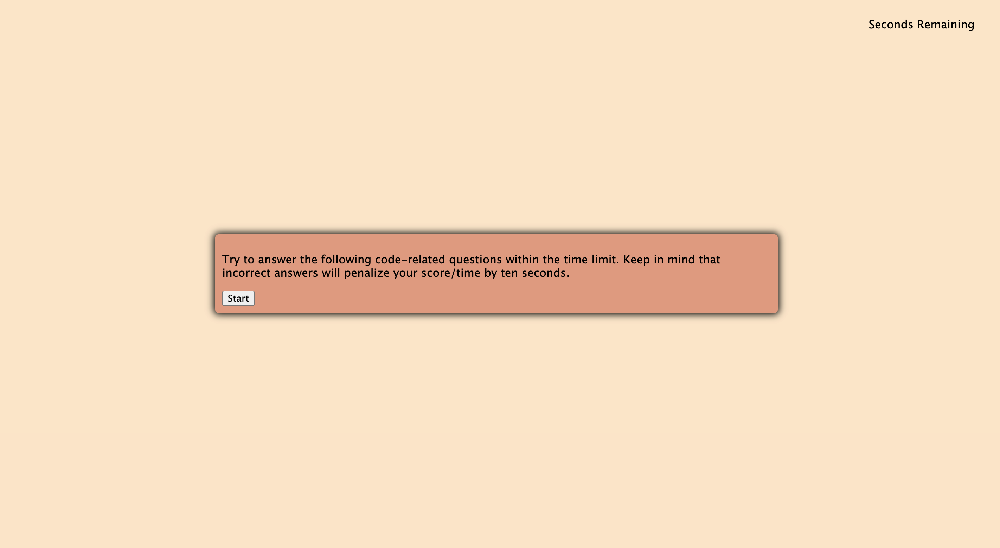
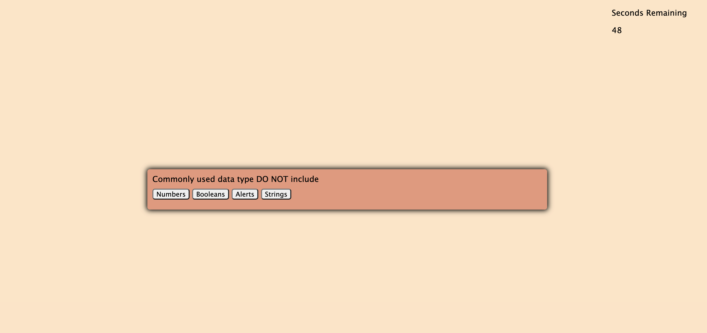
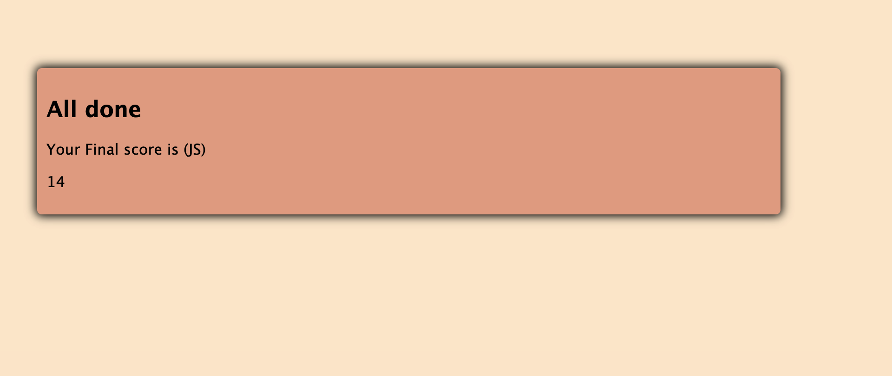

# Title
Code-quiz

# Description
I built this code quiz from scratch as a part of my UCB coding bootcamp homework. It's a quiz with 4 questions for which users have 60 seconds to complete. Each wrong question takes 10 seconds off the timer. It's fairly simple. I enjoyed my learning process on this one because, for the first time, I started to understand JS. This was also my most challenging project to date. 

# Technologies
 -HTML
 -CSS
 -JavaScript

# Deployed Link and URL
- https://priyarizal.github.io/Code-quiz/
- https://github.com/priyarizal/Code-quiz

# Code Snippets with and explanation of what it is and WHY it is significant
This snippet is significant in starting timer/reducing it per second,storing the seconds left when quiz is complete 

'''
var timeleft = 60;
var myTimer;

function startTimer() {
    myTimer = setInterval(function () {
        timeleft -= 1
        updateTimer(timeleft)
    }, 1000)
};

function updateTimer(time) {
    document.querySelector("#timer-input").innerText = time;
    if (time === 0) {
        alert("Quiz over! You're out of time!");
        clearInterval(myTimer);
    }
}
if (currentQuestion === myQuestions.length) {
        endQuiz()
        console.log("i am here")
    } else {
        getNextQuestion()
    }

    console.log(currentQuestion)

# Screen Shots for Design Highlight

# Gif for Demoing Functionality

# Contributors
 -UCB bootcamp instructor Jerome Channete
 - Zubair Shaikh (tutor)
 - Divesh Rizal

